<!-- configuracion de colores es opcional pero ultil-->
<section id="themes">
	<h2>Themes setting</h2>
	

		Themes:  
		<a href="?#/themes">Default</a> -
		<a href="?theme=sky#/themes">Sky</a> -
		<a href="?theme=beige#/themes">Beige</a> -
		<a href="?theme=simple#/themes">Simple</a> -
		<a href="?theme=serif#/themes">Serif</a> -
		<a href="?theme=night#/themes">Night</a>  
		<a href="?theme=moon#/themes">Moon</a> -
		<a href="?theme=solarized#/themes">Solarized</a>
	

</section>

Slide:

# Video games design

Teacher:

Ing. John Higuera

Note: Adaptation to the English language by the monitor of Course.

Slide:

##VIDEO GAME

* A video game is a computer program created
expressly to amuse, based on the interaction
between a person and a electronic device where
run the game.<!-- .element: class="fragment" data-fragment-index="1"-->

* These recreate virtual environments
in which the player can control a character
or any other element of that enviroment to
achieve one or more objectives through some
determined rules.<!-- .element: class="fragment" data-fragment-index="2"-->

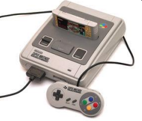 <!-- .element: class="fragment" data-fragment-index="2"-->

Slide:

##VIDEO GAME HISTORY
###PONG (TENNIS FOR TWO)

* William Nighinbottham in 1958 created a game
called Tennis for Two with using an oscilloscope of
Laboratory, which consisted of intercepting
a ball that crosses the screen by moving a
line that was the racket.

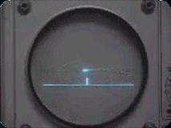

Slide:

###SPACEWAR

* Steve Russell wrote Space War in 1961 at the Massachusetts Institute of Technology.<!-- .element: class="fragment" data-fragment-index="1"-->

* The game was for two
players, each one driving a spaceship and 
tried to shoot the other, also was on the screen
a star whose gravity attracted ships to destroy.<!-- .element: class="fragment" data-fragment-index="2"-->  

* The code Spacewar reached
numerous computers at other universities and is the
first computer game in the history.<!-- .element: class="fragment" data-fragment-index="3"-->

<!-- .element: class="fragment" data-fragment-index="4"-->

Slide:

###NINTENDO

* The Japanese company Nintendo was founded in 1889 by
Fusajiro Yamauchi and even the 70s of XX century
dedicated mainly to the manufacture of cards for games.<!-- .element: class="fragment" data-fragment-index="1"-->

* In 1977 bursts Nintendo console market
household with COLOR TV GAME 6, which included 6
games (all were variations on Pong), 4 colors and
ability to play two players each other.<!-- .element: class="fragment" data-fragment-index="2"-->

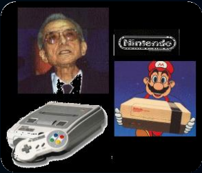 <!-- .element: class="fragment" data-fragment-index="2"-->

Slide:

###NINTENDO (I)

* In 1983 Nintendo opted for the world of consoles
with the success of the Famicom console released by Nintendo
and known in the West as NES (Nintendo
Entertainment System).<!-- .element: class="fragment" data-fragment-index="1"-->

* In 1985 appeared Super Mario bros which was a inflection point 
in the development of electronic games.<!-- .element: class="fragment" data-fragment-index="2"-->

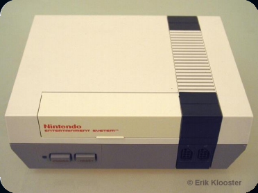 <!-- .element: class="fragment" data-fragment-index="2"-->

Slide:

###NINTENDO (II)

* In the early 90s consoles got a
important technical leap through the competition of
the  generation named "generation of 16-bit".<!-- .element: class="fragment" data-fragment-index="1"-->

* Nintendo Super Famicom (whose name was
changed in the West, becoming Super
Entertainmet Nintendo System "SNES")<!-- .element: class="fragment" data-fragment-index="2"-->

<!-- .element: class="fragment" data-fragment-index="2"-->

Slide:

###NINTENDO (III)

* Rapidly in the decade of the 90s came to
consoles "generation 64-bit": Creating
Nintendo the Nintendo 64 console.<!-- .element: class="fragment" data-fragment-index="1"-->

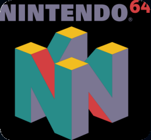<!-- .element: class="fragment" data-fragment-index="1"-->

* Nearly starting the new century Nintendo launched the
successor to the Nintendo 64, the Gamecube.<!-- .element: class="fragment" data-fragment-index="2"-->

Slide:

###NINTENDO (IV)

* The year 2006 marks the continuation of launches
new generation, Nintendo Wii proposes (before
known as Revolution).

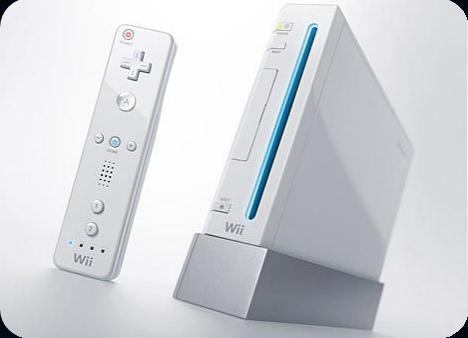

Slide:

###ATARI

* In 1972 Nolan Bushnell founded in the United States, along with
Ted Dabney, the company Syzygy, which is rapidly
renamed Atari. That same year exhibit a
coin arcade machine with the game Pong, version
Tennis For Two.<!-- .element: class="fragment" data-fragment-index="1"-->

* In the 80s Atari word came to be used as
synonymous with video games console, even to refer to
products from other brands.<!-- .element: class="fragment" data-fragment-index="2"-->

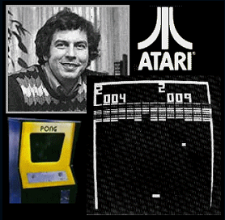<!-- .element: class="fragment" data-fragment-index="2"-->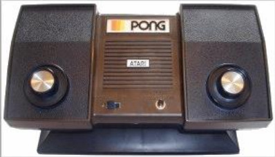<!-- .element: class="fragment" data-fragment-index="2"-->

Slide:

###SEGA(I)

* Service Games was an American company  that in the 40s  marketed primitive machines currencies based on mechanical systems and in the 50s was moved to Japan. In 1965 they merged with Rosen Enterprises to create SEGA.<!-- .element: class="fragment" data-fragment-index="1"-->

* In 1984 after the departure of NES, SEGA launches the Mark III<!-- .element: class="fragment" data-fragment-index="2"-->

* In 1988  SEGA launches Megadrive console 16 bits,
had a better fate than the first console, but not enough
to overcome the SuperNintendo.<!-- .element: class="fragment" data-fragment-index="3"-->

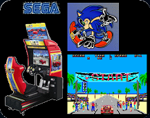<!-- .element: class="fragment" data-fragment-index="3"-->

Slide:

###SEGA(II)

* In 1998 he appeared in Japan the Dreamcast, which come to the West in 1999 and would start the "generation
128 bits". With a very poor success.<!-- .element: class="fragment" data-fragment-index="1"-->

* In 2002 Sega determines that could not compete
especially against Sony's new machine and announcement
would discontinue the Dreamcast and no longer produce
hardware, becoming only developer
software.<!-- .element: class="fragment" data-fragment-index="2"-->

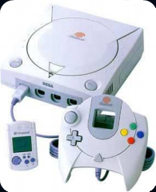<!-- .element: class="fragment" data-fragment-index="2"-->

Slide:

###SONY (I)

* In the mid-90 Sony reappear after a project
started with Nintendo (SNES called PlayStation)
consisting of a peripheral for SNES with CD.
At the end Nintendo Sony rejected the proposal, since
Sega had developed something similar without success, and
Sony launched PlayStation  independently.<!-- .element: class="fragment" data-fragment-index="1"-->

* In 2000 Sony launches the anticipatory
Play Station 2.<!-- .element: class="fragment" data-fragment-index="2"-->

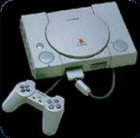<!-- .element: class="fragment" data-fragment-index="2"-->

Slide:

###SONY (II)

* 2006 marks the continuation of launches
new generation of consoles. Sony with its
PlayStation 3 and PS4.

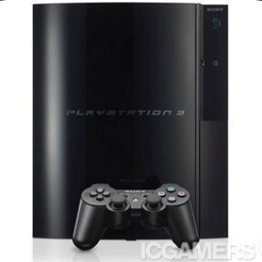 

Slide:

###MICROSOFT

* In 2001 Microsoft enters the industry of consoles
creating the Xbox.<!-- .element: class="fragment" data-fragment-index="1"-->

* The end of 2005 saw the launch of the Xbox 360, the
first console of the seventh generation of 
video games consoles.<!-- .element: class="fragment" data-fragment-index="2"-->

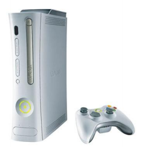<!-- .element: class="fragment" data-fragment-index="2"--> 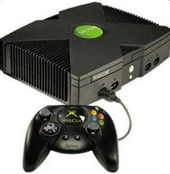<!-- .element: class="fragment" data-fragment-index="2"-->

Slide:

###Bits Wars

Bits 256 (XBox 360, WiiU)

Bits 512 (PS4 y XBox One)

Slide:

###Nintendo and others (III)

WiiU (2011)<!-- .element: class="fragment" data-fragment-index="1"--> 

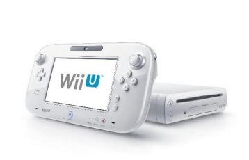 <!-- .element: class="fragment" data-fragment-index="1"-->

The Ouya (2012 )<!-- .element: class="fragment" data-fragment-index="2"-->
 
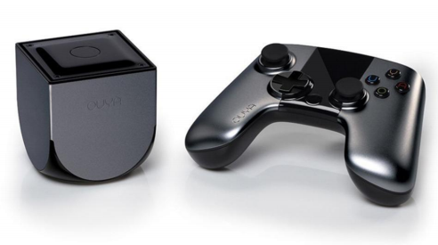 <!-- .element: class="fragment" data-fragment-index="2"-->

Slide:

###Game stores

1999 - Dream Cast Online store with 56k 

2001 - Launch iTunes

2002 -  LIVE Store of Microsoft.

2006 - November, Wii store.

2007 - March, PlayStation Store.

